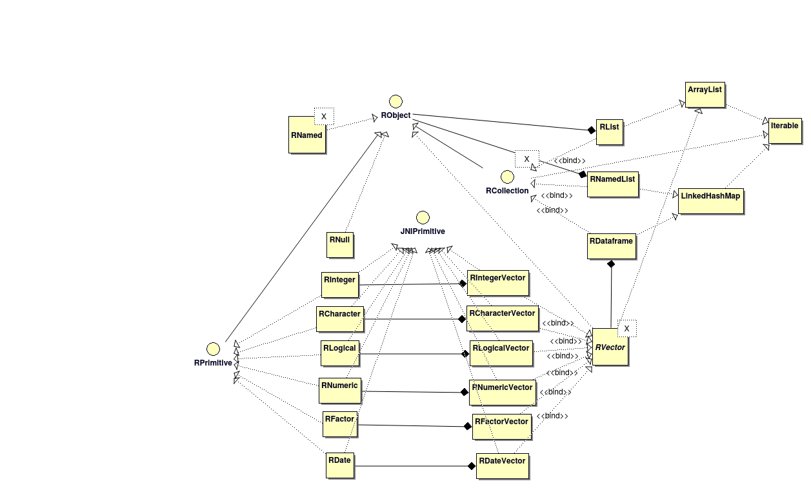

```{r setup, include=FALSE}
knitr::opts_chunk$set(echo = TRUE)
source("./codeSnip.R")

# https://stackoverflow.com/questions/32748248/watermark-in-rmarkdown?rq=1

```

<div class="watermark">DRAFT</div>

# Datatype conversion

R and Java have quite different philosophy on datatypes that mean that loss less round tripping of data through the limited expressibility of the JNI bridge is a non trivial exercise. This is why a code generation library is valuable as it removes the need for developers to understand the grim complexity of the details. The following areas proved to be the most difficult:

* In R everything is a vector. In Java vectors are closest in nature to collections, either Lists or insertion ordered Maps.
* In Java there is a fundamental difference between a single value and an array of values. In R they are interchangeable.
* In R everything can be named. In Java data is not "named" as such unless it is in a Map.
* Java distinguishes between primitive and boxed data types. R has no primitive type except raw bytes.
* JNI only really natively supports primitive data types, and arrays thereof.
* R expects data to be in vector structures containing the same data types, and thus operations on R vectors and dataframes are intrinsically column based operations. Java is generally written to operate on collections of objects which compose different data types into a single structure, and thus operations tend to be intrinsically row based.
* R lists are complex un-typed structures with more similarity to JSON trees than to Java Collections.
* R is 1 based, java is 0 based for indexes.
* R has typed NA values. Java null is un-typed.
* Java void and R NULL are not exactly the same conceptually, as an R variable can be NULL but a Java variable can never be void. Boxed Void types in Java are the programming equivalent of Schrodinger's cat.

By inspecting the Java code at compilation time, and by imposing constraints on the types of data transferred between R and Java, it is possible to use a combination of convention, data-type coercion, and type checking to ensure that inputs to Java code from R are type safe, and (almost) 100% faithful copies of their R equivalents and vice-versa. This differs in approach from `r cran("jsr223")` which performs dynamic data conversion from R types to generic R data structures. This is harder to make consistent and requires a degree of introspection, during the marshaling and un-marshaling process. Enforcing rigid type systems on the interface between R and Java allows the simpler transformation to be made, based on the strongly typed Java code at compile time, which should result in faster but less flexible data transfer.

## Round tripping data from R to Java to R

```{r out.width="100%"}

```


### Nulls and voids

Ensuring an R NULL value is correctly returned requires a placeholder class in Java. This is `uk.co.terminological.rjava.types.RNull` and it enforces some of the identity constraints. Java void types can be best represented as `invisible(NULL)` which is almost the same as not returning anything from a method.

```{r results='asis', echo=FALSE}
codeSnip("java",filename="/home/terminological/Git/r6-generator-maven-plugin-test/src/main/java/uk/co/terminological/rjava/test/BounceTest.java",startMatches = "SECTION_01",endMatches = "SECTION_02")
```

```{r}
# devtools::install("~/Git/r6-generator-maven-plugin-test/r-library/")
J = testRapi::JavaApi$get()
b = J$BounceTest$new()

b$bounceNull(NULL)
b$bounceVoid()
```

### Character data

Strings are the least contentious format with high similarity between R and Java, so long as we are all using UTF-8. An R character vector can be transferred to Java seamlessly except for the fact that asit is transferred it is as an array of characters in JNI. A java equivalent of `uk.co.terminological.rjava.types.RCharacter` is provided to mark the object as an R compatible datatype, in general though `java.lang.String` can used instead of singleton strings. For character vectors we have `uk.co.terminological.rjava.types.RCharacterVector` which is a specialised java collection of `uk.co.terminological.rjava.types.RCharacter`s

```{r results='asis', echo=FALSE}
codeSnip("java",filename="/home/terminological/Git/r6-generator-maven-plugin-test/src/main/java/uk/co/terminological/rjava/test/BounceTest.java",startMatches = "SECTION_02",endMatches = "SECTION_03")
```


```{r}
b$bounceString("Hello")
b$bounceCharacter("Hello")
b$bounceCharacterVector(c("Hello","World"))
```

### Numeric data

Numerics in R can be represented a number of ways in Java, and various Java types, such as `java.lang.Double`, `java.lang.Float`, `java.math.BigDecimal`, `java.lang.Long`, and their primitive counterparts are best be represented by R numerics. The `uk.co.terminological.rjava.types.RNumeric` type allows Java programmers to dynamically convert R Numerics to the desired native type, and the `uk.co.terminological.rjava.RConverter` provides various methods to convert native java types to `uk.co.terminological.rjava.types.RNumeric`s. This also handles the special values of `Inf` and `-Inf`, `NaN`, and `NA_real_` and their equivalent values in Java. To support the use of native Java, singleton `RNumeric`s can be substituted with primitive Java `double` as long as the inputs can never be `NA_real_`. Vector inputs are handled in the same way as before

```{r results='asis', echo=FALSE}
codeSnip("java",filename="/home/terminological/Git/r6-generator-maven-plugin-test/src/main/java/uk/co/terminological/rjava/test/BounceTest.java",startMatches = "SECTION_03",endMatches = "SECTION_04")
```


```{r}
b$bounceDouble(1.23)
# throws an error as primitive double cannot be null
try(b$bounceDouble(NA_real_))

b$bounceNumeric(4.6)

b$bounceNumeric(NA_real_)
b$bounceNumeric(Inf)
b$bounceNumeric(-Inf)
b$bounceNumeric(0/0)

# Wrongly typed input is coerced to numerics
b$bounceNumericVector(c(2L,5L,34L))
b$bounceNumericVector(c(2.3,4.6,NA_real_,34,NaN,Inf,-Inf))

```

### Integer data

In an identical way to above `uk.co.terminological.rjava.types.RInteger` types hold integer values. R inputs to Java functions are coerced to integers and an error thrown if this is not possible. The primitive `int` Java type can be used for singletons if they are not `NA`, and vectors are handled in the same way.

```{r results='asis', echo=FALSE}
codeSnip("java",filename="/home/terminological/Git/r6-generator-maven-plugin-test/src/main/java/uk/co/terminological/rjava/test/BounceTest.java",startMatches = "SECTION_04",endMatches = "SECTION_05")
```


```{r}
b$bounceInt(1)
b$bounceInteger(3)
b$bounceIntegerVector(c(2L,3L,4L))
b$bounceIntegerVector(c(2,3,4))
b$bounceIntegerVector(c(2L,NA,4L))
```

### Factors

Factors are somewhat complicated as a individual factor only makes sense in the context of a vector of possible options. However the `uk.co.terminological.rjava.types.RFactor` type and `uk.co.terminological.rjava.types.RFactorVector` collection allow information to be retained about the values and labels for R Factors. There is support for mapping R factors to Java `Enum` classes which is provided by `uk.co.terminological.rjava.RConverter` and creating R ordered factors from `Enum`s.

```{r results='asis', echo=FALSE}
codeSnip("java",filename="/home/terminological/Git/r6-generator-maven-plugin-test/src/main/java/uk/co/terminological/rjava/test/BounceTest.java",startMatches = "SECTION_05",endMatches = "SECTION_06")
```

```{r}
factorVec = as.factor(c("a","b","c","b","a"))
b$bounceFactor(as.factor(factorVec[[1]]))
b$bounceFactorVector(factorVec)
```

### Dates

Date support is provided by `uk.co.terminological.rjava.types.RDate` which allows R Date and POSIXt tyeps to be represented in Java as `java.time.LocalDate`s. Vectors of dates are also supported as before. There is currently no support for datetime classes but this is a possible enhancement.

```{r results='asis', echo=FALSE}
codeSnip("java",filename="/home/terminological/Git/r6-generator-maven-plugin-test/src/main/java/uk/co/terminological/rjava/test/BounceTest.java",startMatches = "SECTION_06",endMatches = "SECTION_07")
```

```{r}
b$bounceDate(as.Date("2001-02-03"))
class(b$bounceDate(as.Date("2001-02-03")))
b$bounceDateVector(as.Date(c("2001-02-03","2001-02-04","2001-02-05")))
b$bounceDateVector(as.Date(c("2001-02-03",NA,"2001-02-05")))
```

### Logicals

R logicals are mapped to `uk.co.terminological.rjava.types.RLogical` objects which can represent `NA_logical_` values faithfully. If `NA` values are not needed then primitive `boolean` types can be substituted as before, and vectors work as before.

```{r results='asis', echo=FALSE}
codeSnip("java",filename="/home/terminological/Git/r6-generator-maven-plugin-test/src/main/java/uk/co/terminological/rjava/test/BounceTest.java",startMatches = "SECTION_07",endMatches = "SECTION_08")
```

```{r}
b$bounceLogical(TRUE)
b$bounceLogicalVector(c(TRUE,TRUE,FALSE))
b$bounceLogicalVector(c(TRUE,NA,FALSE))
```


### Dataframes

In Java R dataframes are modelled as a named collection of `uk.co.terminological.rjava.types.RVector<?>` of undetermined type. This is represented internally as a column wise Map, but the `uk.co.terminological.rjava.types.RDataframes` class contains a number of methods to make using dataframes intuitive in Java including support for Iterable and Stream interfaces that operate row-wise over the data, or which can map typed columns to a stream of proxy objects satisfying an interface specification supplied by the developer (more examples TBD). The dataframe can support any column with vector data types mentioned above. At present however it does not support named rows, as the focus is on tidy dataframes.

```{r results='asis', echo=FALSE}
codeSnip("java",filename="/home/terminological/Git/r6-generator-maven-plugin-test/src/main/java/uk/co/terminological/rjava/test/BounceTest.java",startMatches = "SECTION_08",endMatches = "SECTION_09")
```

```{r}
b$bounceDataframe(tibble::tibble(
  x=c(0,1,2),
  y=c(3L,2L,1L)
))

b$bounceDataframe(tibble::tibble(
  u=factorVec[1:3],
  v=c(TRUE,NA,FALSE),
  w=c("alpha",NA,"gamma"),
  x=c(0,1,2),
  y=c(3L,2L,1L),
  z=as.Date(c("2001-02-03",NA,"2001-02-05"))
))
```

### Lists

in R lists and named are complex objects with optionally named sequences of arbitrary typed data. They are analgous to JSON objects and it is tempting to serialise all R lists to JSON and use a JSON library to interpret them in Java. This would be possible but lose some of the support built into the R classes mentioned above. As such we took a hybrid approach where R lists and named lists are dynamically and recursively mapped to collection types from R to Java, and exported back from Java to R serialised as a character string containing R code, which is evaluated by the R interpreter. Despite being somewhat hacky this does a surprisingly good job at transferring lists from R to Java and back to R faithfully. However it is probably not well suited to very large lists and definitely could not support lists that have cyclical structures in the object graph. To support fluent use of R Lists in Java all classes that derive from `RObject` support the visitor pattern, which can be used to relatively simply select out datatypes of interest. Support for a XPath like syntax to access specific elements of nested lists is planned.

```{r results='asis', echo=FALSE}
codeSnip("java",filename="/home/terminological/Git/r6-generator-maven-plugin-test/src/main/java/uk/co/terminological/rjava/test/BounceTest.java",startMatches = "SECTION_09",endMatches = "SECTION_10")
```

```{r}
b$bounceList(list("a","b","c",c(1,2,3)))

input = list("a",list("b",1,"z"),"c",c(1,2,3))
output = b$bounceList(input)
if (!identical(input,output)) stop("FAIL")

b$bounceNamedList(list(x="a",b=c("a",NA,"c"),c=1))
```

## Generating data in Java

So far we have concentrated on the use case of transferring data from R to Java and back again. However we also wish to be able to rapidly create data in Java tha is going to be faithfully preserved in R. For this end we have created a number of type converters, builder functions and collectors, that help to marshal native Java data into `RObject`s.

### Primitive equivalents

the `RPrimitive` interface possesses a range of factory methods to generate appropriately typed `RPrimitive`s from Java primitives, boxed types, and enums.

```{r results='asis', echo=FALSE}
codeSnip("java",filename="/home/terminological/Git/r6-generator-maven-plugin-test/src/main/java/uk/co/terminological/rjava/test/FactoryTest.java","SECTION_01","SECTION_02")
```


```{r}
g = J$FactoryTest$new()

g$generateCharacter()
g$generateNumeric()
g$generateInteger()
g$generateFactor()
g$generateLogical()
```

### Vectors

Similarly the `RVector` class supports a range of fluent builder methods which allow de novo creation of correctly typed RVectors. The `RConverter` class also provides a range of collectors that facilitate mapping Java Streams to R Vectors.

```{r results='asis', echo=FALSE}
codeSnip("java",filename="/home/terminological/Git/r6-generator-maven-plugin-test/src/main/java/uk/co/terminological/rjava/test/FactoryTest.java","SECTION_02","SECTION_03")
```

```{r}
g$generateFactorVec()
g$generateIntegerVec() 
g$generateCharacterVec()
g$generateNumericVec()
g$generateLogicalVec()
```

### Dataframes and lists

Both `RDataframe` and `RList` classes implement fluent methods to allow the creation of complex data structures in a method familiar to java programmers. Again `RConverter` provides specialised collectors to map a stream of objects representing sequential rows of data to the columnar format of the `RDataframe` using `MapRule`s specified using functional lambda syntax to define the mapping from object to dataframe column.

```{r results='asis', echo=FALSE}
codeSnip("java",filename="/home/terminological/Git/r6-generator-maven-plugin-test/src/main/java/uk/co/terminological/rjava/test/FactoryTest.java","SECTION_03","SECTION_04")
```

```{r}
g$generateDataframe()
g$generateStreamDataframe()
```

Finally a note on list generation that contains enum values in Java cannot always be converted to factors in R. If this is not possible then the conversion will fall back to a character string of the label of the factor value.

```{r results='asis', echo=FALSE}
codeSnip("java",filename="/home/terminological/Git/r6-generator-maven-plugin-test/src/main/java/uk/co/terminological/rjava/test/FactoryTest.java","SECTION_04","SECTION_05")
```

```{r}
g$generateList()
g$generateNamedList()
```