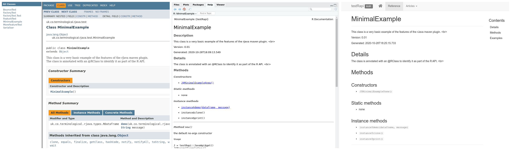

```{r setup, include=FALSE}
knitr::opts_chunk$set(echo = FALSE)

source("./codeSnip.R")
```

<div class="watermark">DRAFT</div>

# Introduction

The R6 Generator Maven Plugin[@TerminologicalR6generatormavenplugin2020] provides a low friction route to integrating Java code into R programs. `r cran("rJava")`[@urbanekRJavaLowLevelJava2020] is a low level interface for using Java libraries in R via the Java Native Interface (JNI). However use of this low level interface has a steep learning curve for both R and Java programmers, as it requires an in-depth understanding of the limitations of the JNI interface between R and Java. The `r cran("jsr223")`[@gilbertJsr223JavaPlatform2020] package aims to made to reduce this friction in the situation where dynamic interaction between R and Java is needed, by integration of Java based scripting languages, such as Kotlin or Groovy, and an ancillary package that manages dynamic data-type translation - `r cran("jdx")`[@gilbertJdxJavaData2020]. Although simplifying data type conversion, this is still a relatively complex solution for the situation where a developer wishes to package Java based functions for use in R programs, for native R use as a library. The `r cran("R6")`[@changR6EncapsulatedClasses2019] package brings class structures to R. This article describes a novel approach to integrating Java code with R, involving compile time R code generation, which results in an R6 class library that provides a native R interface to the Java library. This offers a range of benefits for the simple case of package development over existing approaches.

## Strengths and weaknesses of Java and R

R and Java are two very different languages and each have specific strengths and weaknesses. 
* R ease of data import and integration, spatial support
* R visualization
* R data wrangling
* R REPL
* Java ease of multithreaded processing. 
* Java strongly typed versus R dynamically typed
* Java complex dependency and classpath management.
  * Maven build tools as solution to this
* Java VM debugging versus R debugging

## Existing integration of R and Java

Integration between Java and R has existed since the release of `r cran("rJava")` in 2003, which uses JNI to transfer data between a Java process and R process running on same machine, however successful use of Java libraries within R has remained difficult as JNI interface operates at a low level on primitive data structures. rJava provides infrastructure allowing execution of compiled Java code on a running JVM process, with data from R, but to do so requires an in depth knowledge of the behaviour of JNI in transferring data to on from Java. Writing R code to use Java libraries via JNI provides limited support for code completion, type analysis, and debugging of the state of variables within the Java Virtual Machine. In most applications of rJava, a native R library is provided that encapsulates the R code managing communication across the JNI and state, thus protecting the regular R user from the complexity. This is the case for libraries such as RMallet which provides a wrapper around the Java Mallet library. The problem with this is that Java integration in R is limited by the interest of the few people who have been through the learning curve required to create such wrappers, let alone maintain them as the Java libraries evolve.

As an alternative to this there have been recent developments in the R jsr223 package. This provides a high level interface to Java by providing access to a middle layer provided by any of a number of Java based scripting languages, such as Kotlin, Groovy and Javascript. R code can interact directly with these scripting languages and pass variables back and forwards with relative ease and the java based scripting languages can communicate with native Java code running on the same JVM. This has a number of benefits

A third approach is data only integration, e.g. Apache Arrow. 

# Use cases

* Java library development for R use
* Adaption of java library for R use

# Desiderata / Design rationale

* R as REPL, Java as backend 
* No knowledge of JNI, rJava or intermediate languages required.
* High performance - minimise interpretation, Compile time - strongly typed inputs to R - minimise data transfer overhead. minimise use of reflection
* Accurate data transformations and round trip
* Dependency management - 
* Separation of concerns & isolation - java based API layer to isolate Java changes from R API changes
* Predictability  - Runtime library  - predictable R data in Java code isolating java from R type system
* Seamless R use of library - R6 class hierarchy - native R facade to Java code
* Tidyverse philosophy
* CRAN ready submission from Java library

# Terminology and concepts

Maven plugin - 
Runtime dependency - R types for java

# Feature documentation

Maven is a Java dependency management and build tool, which is one of the cornerstones of the Java development ecosystem. It has a flexible plugin mechanism which the R6 Generator Maven Plugin is based on, and allows us to write code that is executed during the Java compilation process, and allows for code generation basd on the structure of the Java code. When Maven is appropriately configured to build an R6 Generator enabled Java project, the project is compiled into a Java archive (jar) with all required dependencies, and an R6 class structure is created that mirrors the Java library structure in a specified sub-directory of the Maven Java project (in this case "r-library"). This sub-directory contains all of the components of a R package, including a set of R source files defining a set of R6 classes, DESCRIPTION and NAMESCAPE files, LICENSE and CITATION files and a set of Rd documentation files. 

## Minimal example

```{r results='asis',echo=FALSE}
codeSnip("java",filename="/home/terminological/Git/r6-generator-maven-plugin-test/src/main/java/uk/co/terminological/rjava/test/MinimalExample.java")
```


```{r results='asis',echo=FALSE}
codeSnipByLine(type="xml",filename="/home/terminological/Git/r6-generator-maven-plugin-test/pom.xml",
         starts = c(5,19,27,43,53),
         ends = c(10,25,41,44,Inf), 
         sep = "\n...\n")
```


## R6 class generation

```{r, include=FALSE}
fs::dir_tree(path = "/home/terminological/Git/r6-generator-maven-plugin-test/r-library/", recurse = TRUE)
```
## Maven packaging
## Generated R6 documentation

```{r out.width="100%"}

```

## Datatype transformation
### Java to R
### R to Java - runtime library
## Debugging Java code
* Datasets for testing Java code / serialisation of inputs
* Debugging flag


# Benefits

* Low friction
* Minimal dependencies introduced.
* Java Library dependency packaging
* Accurate bidirectional transfer of data between R and Java
* Type safety
* Code completion and type hinting in R
* Fluent use of R data in java 
* R Documentation
* Separation of concerns
* Maintenance

# Limitations

* Fat Jar bloat
* Recompilation and iterative development
* Naming collisions
* Concurrent use of Multiple rJava libraries
* Java class caching 

# Future development

* Tighter integration of multithreading and promises.
* Matrix support
* Named rows in dataframes
* R test case generation
* Java object bindings
* Purrr style lists in data frames

# Introduction

# References

<div id="refs"></div>